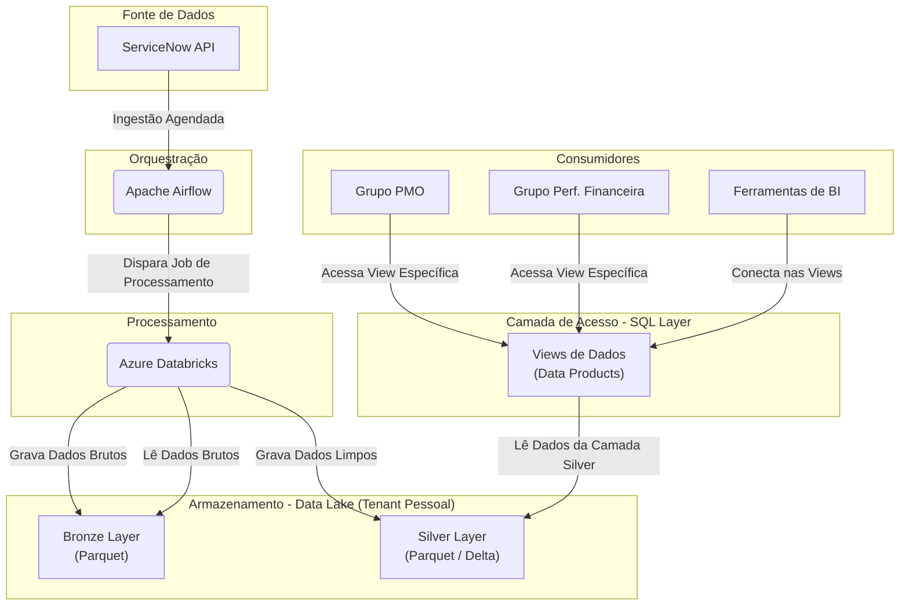
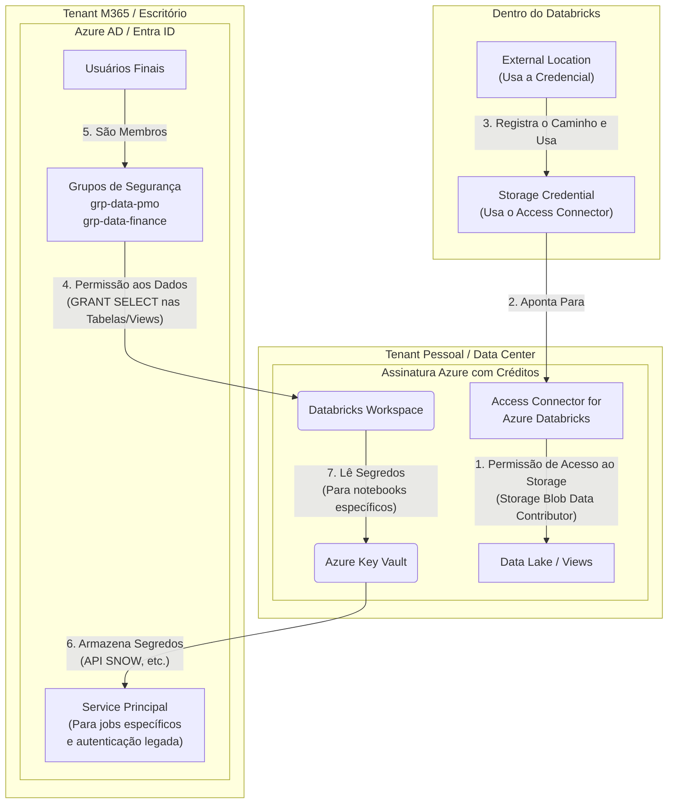
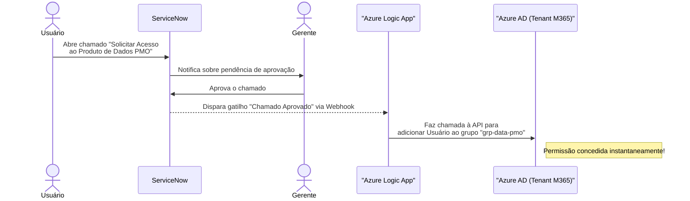

# Projeto de Portfólio: Plataforma de Engenharia de Dados

Este projeto demonstra a construção de uma plataforma de dados de ponta a ponta, desde a ingestão da fonte de dados (ServiceNow) até a camada de consumo governada, utilizando práticas modernas de Engenharia de Dados, DataOps e arquitetura Multi-Tenant.

## 🎯 Objetivo

O objetivo é ingerir dados de gestão de projetos do **ServiceNow**, processá-los e transformá-los em uma camada confiável (Silver), e então expor "Produtos de Dados" seguros para diferentes grupos de usuários (PMO e Performance Financeira). O acesso a esses produtos é solicitado e automatizado através de um fluxo de chamados no próprio ServiceNow, implementando um ciclo completo de governança de dados.

## 🏗️ Arquitetura Detalhada do Projeto

A arquitetura do projeto é dividida em três visões complementares: o fluxo de dados, a estrutura de segurança e o processo de negócio para solicitação de acesso.

### 1. Arquitetura de Dados (Fluxo de Dados)

Este diagrama mostra o caminho que os dados percorrem, desde a origem até se tornarem informação útil para o consumidor final.

### 2. Arquitetura de Segurança

### 3. Processo de Negócio para Solicitação de Acesso

